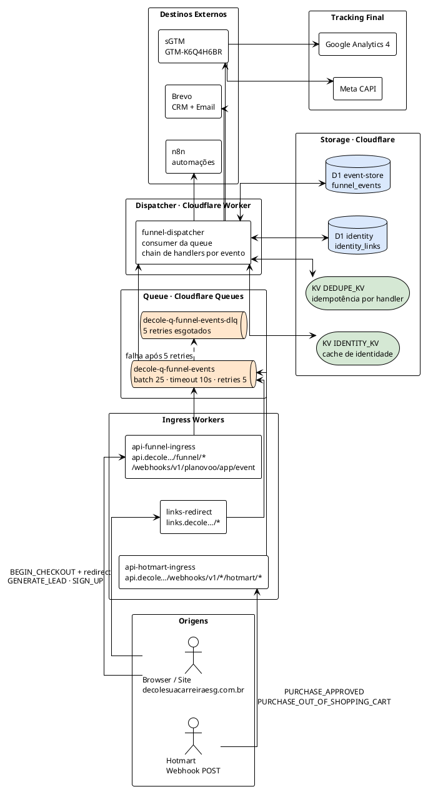
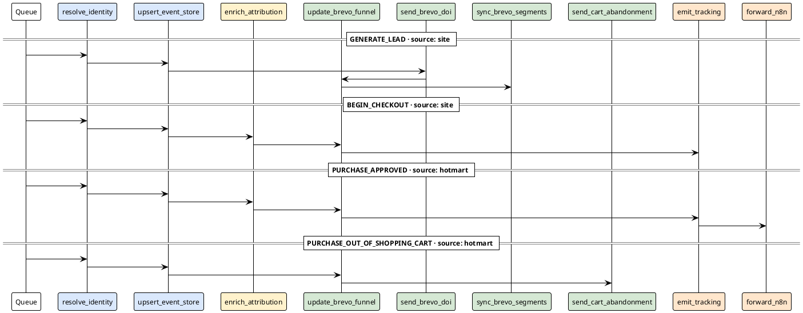
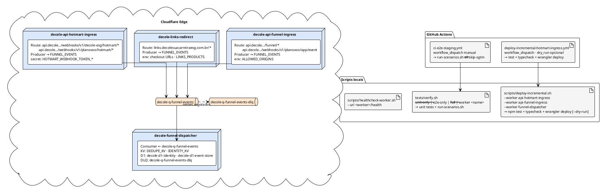
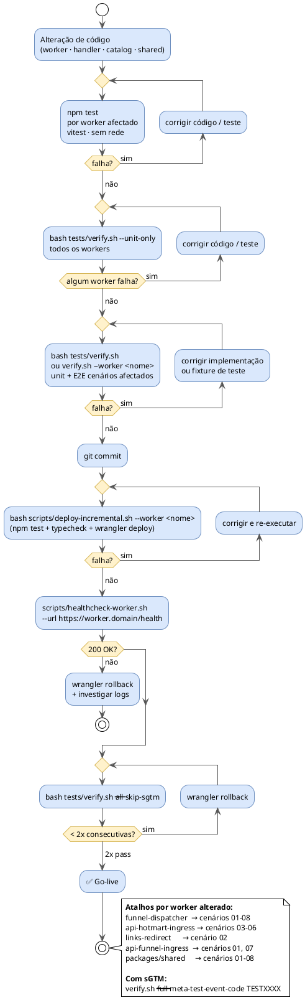

# Diagramas do Sistema DECOLE — Cloudflare

> Formato: PlantUML. Renderizar com VS Code (extension: PlantUML), IntelliJ ou `plantuml -tsvg *.puml`.
> Última actualização: 2026-04-28.

---

## 1 · Arquitetura do Sistema

Visão de componentes e fluxo de dados de ponta a ponta.

---

## 2 · Chains de Handlers por Evento

Cada evento entra na queue com um `event_type` e `product_code`. O `funnel-dispatcher` lê a chain do `products.catalog.json` e executa os handlers em ordem. Cada handler é idempotente via `DEDUPE_KV`.

**O que cada handler faz:**

| Handler | Acção | Storage |
|---------|-------|---------|
| `resolve_identity` | Email → `profile_id` (hash + lookup) | KV IDENTITY_KV · D1 identity_links |
| `upsert_event_store` | Persiste evento + attribution merged no `payload_json` | D1 funnel_events |
| `enrich_attribution` | Lê site events do D1 → recupera `fbp`/`fbc`/`client_ip` para eventos hotmart | D1 funnel_events (leitura) |
| `update_brevo_funnel` | Actualiza campos de funil no CRM (estágio, datas) | Brevo Contacts API |
| `send_brevo_doi` | Envia email DOI (double opt-in) via template Brevo | Brevo SMTP |
| `sync_brevo_segments` | Adiciona/remove contacto das listas correctas | Brevo Lists API |
| `send_cart_abandonment_email` | Email de carrinho abandonado via template | Brevo SMTP |
| `emit_tracking` | Envia payload para sGTM `/mp/collect` → GA4 + Meta CAPI | sGTM (GTM-K6Q4H6BR) |
| `forward_n8n` | Webhook para n8n (automações pós-compra) | n8n |

---

## 3 · Deployment & Infraestrutura

Workers, routes, bindings e CI/CD.

**Bindings do `funnel-dispatcher`:**

| Binding | Tipo | Recurso |
|---------|------|---------|
| `DEDUPE_KV` | KV Namespace | `aadb6b3ff1024cc5aeb3119e6c662863` |
| `IDENTITY_KV` | KV Namespace | `88989e2e3492459eadb06e9da523dfae` |
| `IDENTITY_DB` | D1 Database | `decole-d1-identity` · `e71a266a-b400-4970-a056-bf7223799f25` |
| `EVENT_STORE_DB` | D1 Database | `decole-d1-event-store` · `f5c19aac-2bdc-4fe4-b560-e1c49199ff4c` |

---

## 4 · Fluxo de Desenvolvimento

Do código à produção.

**Mapeamento mudança → verificação mínima:**

| Ficheiro alterado | Comando mínimo | Cenários E2E |
|-------------------|----------------|--------------|
| `funnel-dispatcher/src/**` | `verify.sh --worker funnel-dispatcher` | 01–08 |
| `api-hotmart-ingress/src/**` | `verify.sh --worker api-hotmart-ingress` | 03–06 |
| `links-redirect/src/**` | `verify.sh --worker links-redirect` | 02 |
| `api-funnel-ingress/src/**` | `verify.sh --worker api-funnel-ingress` | 01, 07 |
| `packages/shared/**` | `verify.sh` (todos) | 01–08 |
| `config/products.catalog.json` | `verify.sh` (todos) | 01–08 |
